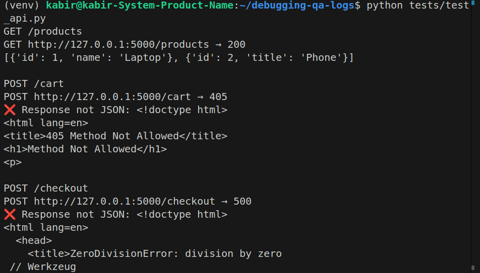
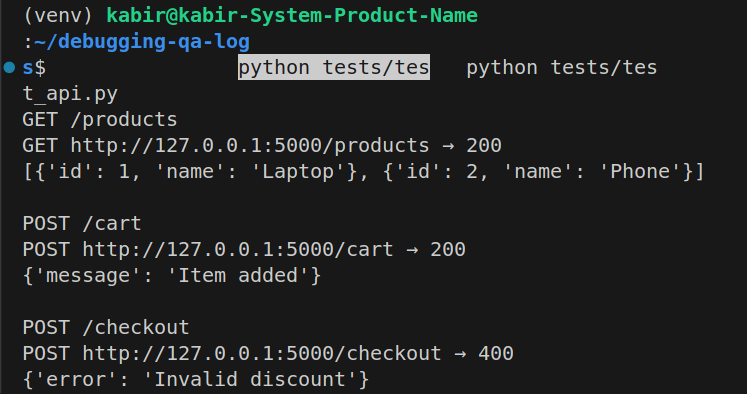

# 🐞 Debugging & QA Logs – Flask API

This project demonstrates **debugging skills** using an intentionally buggy Flask API.  
I ran the broken version (`app.py`), diagnosed failures, and then created a fixed version (`fixed_app.py`).  
The process is documented step by step in [Debugging Logs](./docs/debugging_logs.md).  

---

## 📌 Overview
- **Buggy API (`app.py`)**: Contains schema mismatch, wrong HTTP method, and a crash on division by zero.  
- **Fixed API (`fixed_app.py`)**: Corrected version with consistent schema, proper methods, and safe error handling.  
- **Test Script (`tests/test_api.py`)**: Python requests-based script to verify endpoints.  
- **Documentation (`docs/`)**: Includes debugging logs and screenshots (before vs after).  

---

## ⚙️ Tech Stack
- **Flask** → lightweight Python API framework  
- **Requests** → for API testing  
- **Python 3.12**  
- **VS Code + Linux** environment  

---

## 🚀 Setup & Run

### 1. Clone Repo & Setup Virtual Environment
```bash
git clone https://github.com/your-username/debugging-qa-logs.git
cd debugging-qa-logs
python3 -m venv venv
source venv/bin/activate
pip install -r requirements.txt
````

### 2. Run Buggy Version

```bash
python app.py
```

In another terminal:

```bash
python tests/test_api.py
```

Expected buggy behavior:

* `GET /products` → schema mismatch (`title` instead of `name`)
* `POST /cart` → `405 Method Not Allowed`
* `POST /checkout` → `500 Internal Server Error`

---

### 3. Run Fixed Version

```bash
python fixed_app.py
```

In another terminal:

```bash
python tests/test_api.py
```

Expected fixed behavior:

* `GET /products` → consistent schema ✅
* `POST /cart` → `{"message": "Item added"}` ✅
* `POST /checkout` → `{"error": "Invalid discount"}` with `400` ✅

---

## 📊 Debugging Results

### Buggy Run (`app.py`)



### Fixed Run (`fixed_app.py`)



---

## 📖 Documentation

See full debugging diary here:
👉 [Debugging Logs](./docs/debugging_logs.md)

---

## 🎯 Key Takeaways

* Practiced **finding and fixing API bugs** step by step.
* Gained experience in **schema validation, HTTP methods, and error handling**.
* Learned to use **logs + test automation** to verify fixes.
* Deliverable demonstrates **QA + debugging mindset** for real-world APIs.

---

👨‍💻 **Author**: Md. Hasanul Kabir
🔗 [LinkedIn](https://linkedin.com/in/hasanulkabir_md) | [Portfolio](https://your-portfolio.com)

👉 Do you also want me to write a **1-line repo description** (for the GitHub “About” section) so recruiters see the purpose immediately?
```


