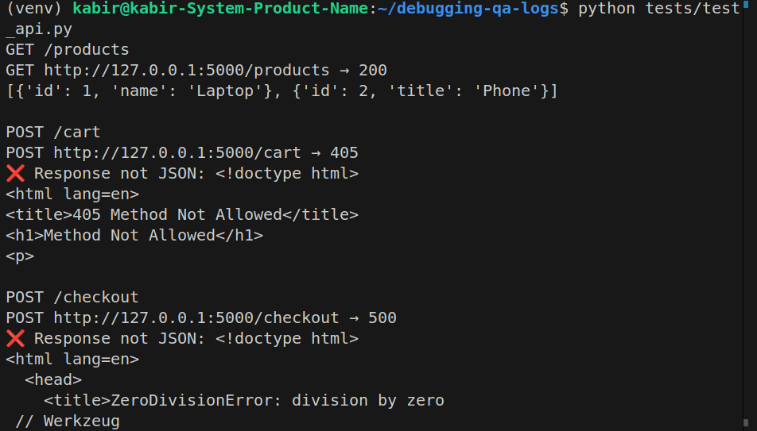

# Debugging Log

## Issue 1: GET /products schema mismatch
- Symptom: One product has "title" instead of "name".
- Root cause: Typo in `app.py`.
- Fix: Change "title" → "name".
- ✅ Verified after fix: Consistent schema.

## Issue 2: POST /cart returned JSONDecodeError
- Symptom: Client failed with JSONDecodeError.
- Root cause: Endpoint defined with GET instead of POST.
- Fix: Change route method from GET → POST.
- ✅ Verified after fix: Returns {"message": "Item added"}.

## Issue 3: /checkout division by zero
- Symptom: Crash when discount=0.
- Root cause: total / discount without validation.
- Fix: Add guard clause → return error if discount==0.
- ✅ Verified after fix: Returns {"error": "Invalid discount"}.

## 📸 Screenshots

### Buggy Run (`app.py`)

### Fixed Run (`fixed_app.py`)

---

## 🎯 Takeaway
- Practiced **debugging real API issues**.  
- Learned to use **logs, error messages, and test scripts** for diagnosis.  
- Demonstrated ability to fix **schema mismatches, HTTP method issues, and unhandled exceptions**.
